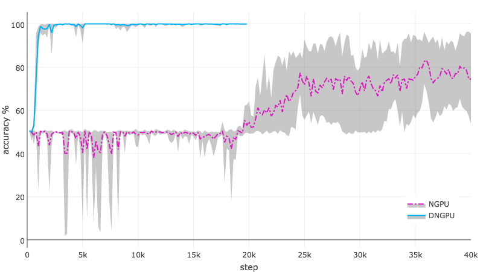
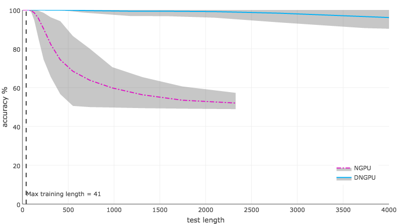

# DNGPU
Code for reproducing key results in the paper

**Improving the Neural GPU Architecture for Algorithm Learning**  
by _Karlis Freivalds, Renars Liepins_
  
 [[`arXiv`](https://arxiv.org/abs/1702.08727)] [[`BibTeX`](#CitingDNGPU)] [[`OpenReview`](https://openreview.net/forum?id=HkxmF0sqyQ)]

The code demonstrates several improvements to the Neural GPU that substantially reduces training time and improves generalization. The improvements are: 1) hard nonlinearities with saturation cost; 2) diagonal gates that can be applied to active-memory models.

### Porformance comparison with NGPU
The proposed improvements achieve substantial gains:
* the model can learn binary multiplication in 800 steps versus 30000 steps that are needed for the original Neural-GPU;
* all the trained models generalize to 100 times longer inputs with less than 1% error versus the original Neural-GPU where only some generalize to less then 10 times longer inputs.

Training Speed & Accuracy  |  Genaralization on longer inputs
:-------------------------:|:-------------------------:
 Training speed and accuracy on test set length 401 for binary multiplication. |  Generalization on longer inputs for binary multiplication. (The vertical dashed line shows max training length)


## Dependencies

This project requires TensorFlow version 1.0

## Running Experiment

We provide the source code to run the training example:

```bash
python DNGPU_trainer.py
```


## <a name="CitingDNGPU"></a>Citing DNGPU

If you use DNGPU, please use the following BibTeX entry.

```
  @InProceedings{Freivalds2018DNGPU,
  title={Improving the Neural GPU Architecture for Algorithm Learning},
  author={Karlis Freivalds, Renars Liepins},
  journal={The ICML workshop Neural Abstract Machines \& Program Induction v2 (NAMPI)},
  year={2018}
  }
